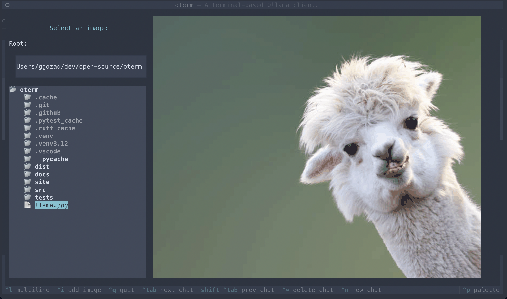

### Commands
By pressing <kbd>^ Ctrl</kbd>+<kbd>p</kbd> you can access the command palette from where you can perform most of the chat actions. The following commands are available:

* `New chat` - create a new chat session
* `Edit chat parameters` - edit the current chat session (change system prompt, parameters or format)
* `Rename chat` - rename the current chat session
* `Export chat` - export the current chat session as markdown
* `Delete chat` - delete the current chat session 
* `Clear chat` - clear the chat history, preserving model and system prompt customizations
* `Regenerate last Ollama message` - regenerates the last message from Ollama (will override the `seed` for the specific message with a random one.) Useful if you want to change the system prompt or parameters or just want to try again.
* `Pull model` - pull a model or update an existing one.
* `Change theme` - choose among the available themes.
  
### Keyboard shortcuts

The following keyboard shortcuts are supported:

* <kbd>^ Ctrl</kbd>+<kbd>q</kbd> - quit

* <kbd>^ Ctrl</kbd>+<kbd>l</kbd> - switch to multiline input mode
* <kbd>^ Ctrl</kbd>+<kbd>i</kbd> - select an image to include with the next message
* <kbd>↑/↓</kbd> (while messages are focused) - navigate through the messages
* <kbd>↑</kbd> (while prompt is focused)    - navigate through history of previous prompts

* <kbd>^ Ctrl</kbd>+<kbd>n</kbd> - open a new chat
* <kbd>^ Ctrl</kbd>+<kbd>Backspace</kbd> - close the current chat

* <kbd>^ Ctrl</kbd>+<kbd>Tab</kbd> - open the next chat
* <kbd>^ Ctrl</kbd>+<kbd>Shift</kbd>+<kbd>Tab</kbd> - open the previous chat

In multiline mode, you can press <kbd>Enter</kbd> to send the message, or <kbd>Shift</kbd>+<kbd>Enter</kbd> to add a new line at the cursor.

While Ollama is inferring the next message, you can press <kbd>Esc</kbd> to cancel the inference.

!!! note
    Some of the shortcuts may not work in a certain context, if they are overriden by the widget in focus. For example pressing <kbd>↑</kbd> while the prompt is in multi-line mode.

    If the key bindings clash with your terminal, it is possible to change them by editing the configuration file. See [Configuration](/oterm/app_config).

### Copy / Paste

It is difficult to properly support copy/paste in terminal applications. You can copy blocks to your clipboard as such:

* clicking a message will copy it to the clipboard.
* clicking a code block will only copy the code block to the clipboard.

For most terminals there exists a key modifier you can use to click and drag to manually select text. For example:
* `iTerm`  <kbd>Option</kbd> key.
* `Gnome Terminal` <kbd>Shift</kbd> key.
* `Windows Terminal` <kbd>Shift</kbd> key.

The image selection interface.
